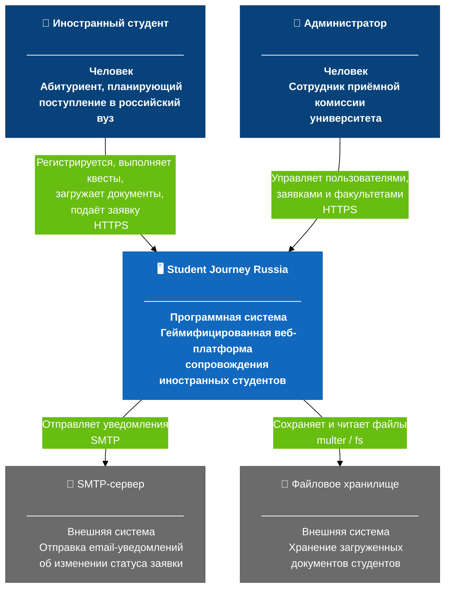

# Диаграмма 1 — C4 Context (контекстная диаграмма)
# Открыть: https://mermaid.live → вставить код ниже

```mermaid
%%{init: {'theme': 'base', 'themeVariables': {'fontSize': '15px', 'primaryColor': '#1168BD', 'primaryTextColor': '#fff'}}}%%
graph TB
    classDef person fill:#08427B,color:#fff,stroke:#073B6F,font-weight:bold
    classDef system fill:#1168BD,color:#fff,stroke:#0E5EB0,font-weight:bold
    classDef external fill:#6B6B6B,color:#fff,stroke:#5A5A5A

    P1["👤 Иностранный студент
    ─────────────────────
    Человек
    Абитуриент, планирующий
    поступление в российский вуз"]

    P2["👤 Администратор
    ─────────────────────
    Человек
    Сотрудник приёмной комиссии
    университета"]

    S1["🖥️ Student Journey Russia
    ─────────────────────
    Программная система
    Геймифицированная веб-платформа
    сопровождения иностранных студентов"]

    E1["📧 SMTP-сервер
    ─────────────────────
    Внешняя система
    Отправка email-уведомлений
    об изменении статуса заявки"]

    E2["💾 Файловое хранилище
    ─────────────────────
    Внешняя система
    Хранение загруженных
    документов студентов"]

    P1 -->|"Регистрируется, выполняет квесты,
    загружает документы, подаёт заявку
    HTTPS"| S1

    P2 -->|"Управляет пользователями,
    заявками и факультетами
    HTTPS"| S1

    S1 -->|"Отправляет уведомления
    SMTP"| E1

    S1 -->|"Сохраняет и читает файлы
    multer / fs"| E2

    class P1,P2 person
    class S1 system
    class E1,E2 external
```
