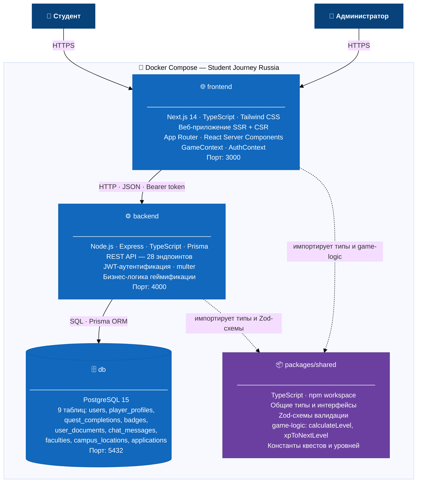

# Диаграмма 2 — C4 Container (контейнерная диаграмма)
# Открыть: https://mermaid.live → вставить код ниже

```mermaid
%%{init: {'theme': 'base', 'themeVariables': {'fontSize': '14px'}}}%%
graph TB
    classDef person fill:#08427B,color:#fff,stroke:#073B6F,font-weight:bold
    classDef frontend fill:#1168BD,color:#fff,stroke:#0E5EB0
    classDef backend fill:#1168BD,color:#fff,stroke:#0E5EB0
    classDef database fill:#1168BD,color:#fff,stroke:#0E5EB0
    classDef shared fill:#6B3FA0,color:#fff,stroke:#5A3585

    P1["👤 Студент"]
    P2["👤 Администратор"]

    subgraph Docker["🐳 Docker Compose — Student Journey Russia"]
        direction TB

        FE["🌐 frontend
        ─────────────────────────────
        Next.js 14 · TypeScript · Tailwind CSS
        Веб-приложение SSR + CSR
        App Router · React Server Components
        GameContext · AuthContext
        Порт: 3000"]

        BE["⚙️ backend
        ─────────────────────────────
        Node.js · Express · TypeScript · Prisma
        REST API — 28 эндпоинтов
        JWT-аутентификация · multer
        Бизнес-логика геймификации
        Порт: 4000"]

        DB[("🗄️ db
        ─────────────────────────────
        PostgreSQL 15
        9 таблиц: users, player_profiles,
        quest_completions, badges,
        user_documents, chat_messages,
        faculties, campus_locations, applications
        Порт: 5432")]

        SH["📦 packages/shared
        ─────────────────────────────
        TypeScript · npm workspace
        Общие типы и интерфейсы
        Zod-схемы валидации
        game-logic: calculateLevel, xpToNextLevel
        Константы квестов и уровней"]
    end

    P1 -->|"HTTPS"| FE
    P2 -->|"HTTPS"| FE
    FE -->|"HTTP · JSON · Bearer token"| BE
    BE -->|"SQL · Prisma ORM"| DB
    FE -.->|"импортирует типы и game-logic"| SH
    BE -.->|"импортирует типы и Zod-схемы"| SH

    class P1,P2 person
    class FE frontend
    class BE backend
    class DB database
    class SH shared
```
