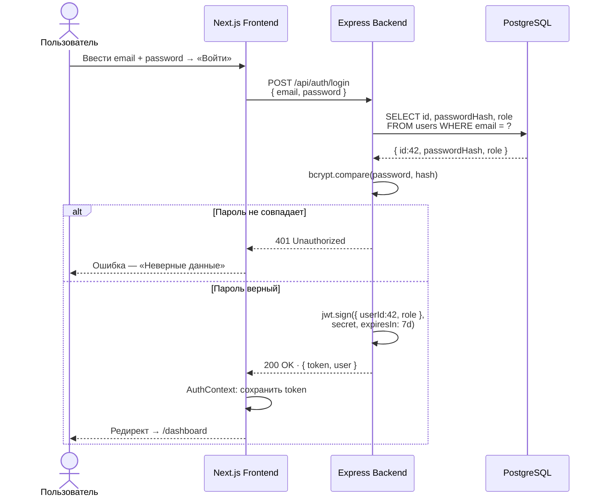

# Диаграмма 4 — Последовательность: Аутентификация (JWT)
# Открыть: https://mermaid.live → вставить код ниже

```mermaid
sequenceDiagram
    actor User as Пользователь
    participant FE as Next.js Frontend
    participant BE as Express Backend
    participant DB as PostgreSQL

    User->>FE: Ввести email + password → «Войти»
    FE->>BE: POST /api/auth/login<br/>{ email, password }
    BE->>DB: SELECT id, passwordHash, role<br/>FROM users WHERE email = ?
    DB-->>BE: { id:42, passwordHash, role }
    BE->>BE: bcrypt.compare(password, hash)

    alt Пароль не совпадает
        BE-->>FE: 401 Unauthorized
        FE-->>User: Ошибка — «Неверные данные»
    else Пароль верный
        BE->>BE: jwt.sign({ userId:42, role },<br/>secret, expiresIn: 7d)
        BE-->>FE: 200 OK · { token, user }
        FE->>FE: AuthContext: сохранить token
        FE-->>User: Редирект → /dashboard
    end
```
