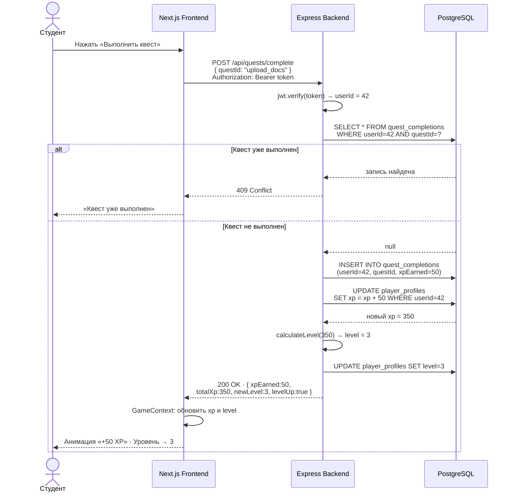

# Диаграмма 5 — Последовательность: Выполнение квеста и начисление XP
# Открыть: https://mermaid.live → вставить код ниже

```mermaid
sequenceDiagram
    actor User as Студент
    participant FE as Next.js Frontend
    participant BE as Express Backend
    participant DB as PostgreSQL

    User->>FE: Нажать «Выполнить квест»
    FE->>BE: POST /api/quests/complete<br/>{ questId: "upload_docs" }<br/>Authorization: Bearer token

    BE->>BE: jwt.verify(token) → userId = 42
    BE->>DB: SELECT * FROM quest_completions<br/>WHERE userId=42 AND questId=?

    alt Квест уже выполнен
        DB-->>BE: запись найдена
        BE-->>FE: 409 Conflict
        FE-->>User: «Квест уже выполнен»
    else Квест не выполнен
        DB-->>BE: null
        BE->>DB: INSERT INTO quest_completions<br/>(userId=42, questId, xpEarned=50)
        BE->>DB: UPDATE player_profiles<br/>SET xp = xp + 50 WHERE userId=42
        DB-->>BE: новый xp = 350
        BE->>BE: calculateLevel(350) → level = 3
        BE->>DB: UPDATE player_profiles SET level=3
        BE-->>FE: 200 OK · { xpEarned:50,<br/>totalXp:350, newLevel:3, levelUp:true }
        FE->>FE: GameContext: обновить xp и level
        FE-->>User: Анимация «+50 XP» · Уровень → 3
    end
```
